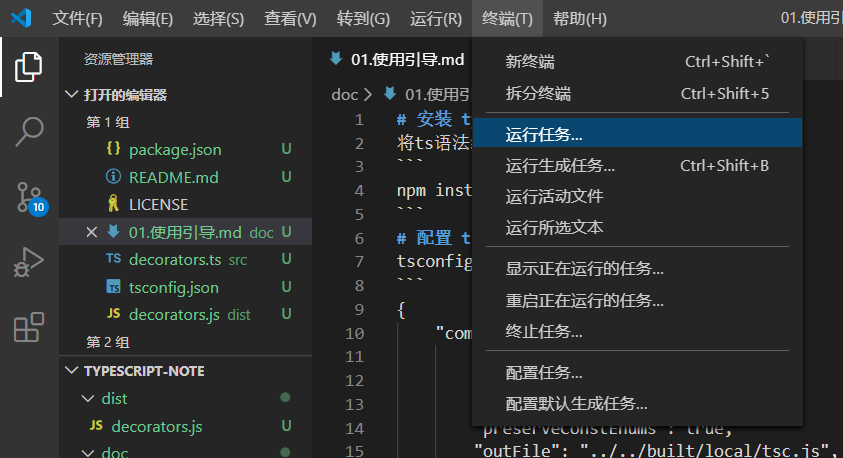
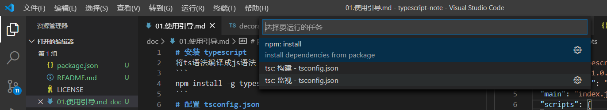

# 安装 typescript
将ts语法编译成js语法
```
npm install -g typescript
```
# 配置 tsconfig.json
tsconfig.json
```
{
    "compilerOptions": {
        "module": "system",
        "outDir": "./dist"
    },
    "include": [
        "./src"
    ],
    "exclude": [
        "./node_modules",
    ]
}
```
# 自动编译ts文件
终端->运行任务 | Tenimal->Run Task
      

选择 **tsc:监视 - tsconfig.json** | **tsc:watch-tsconfig.json**
      